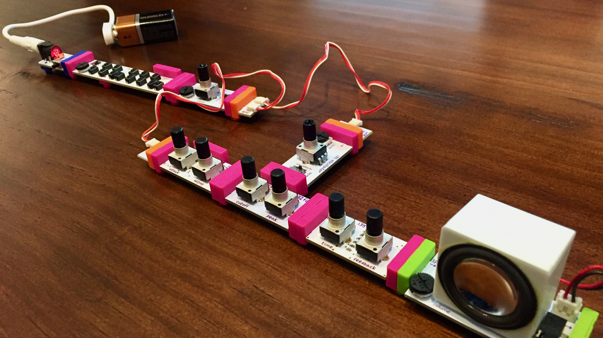
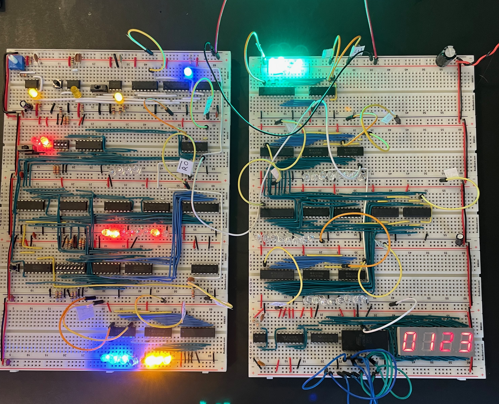
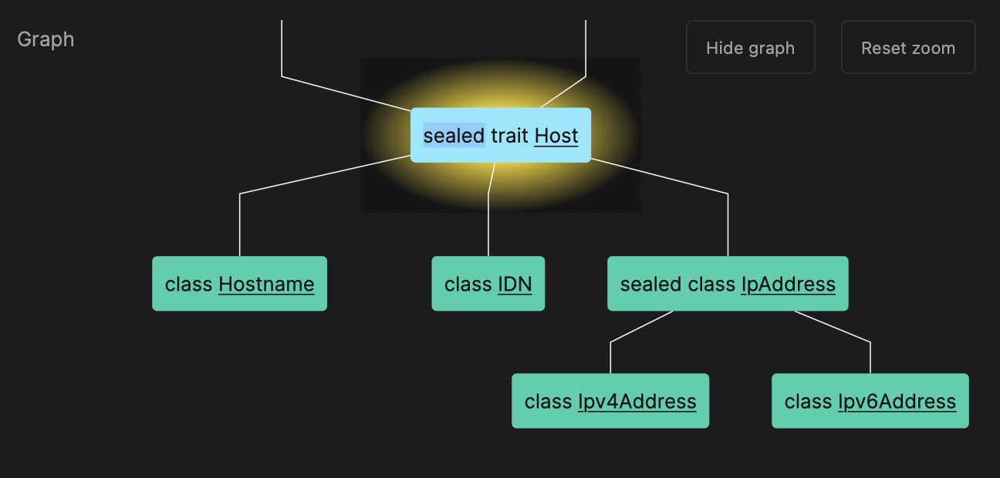
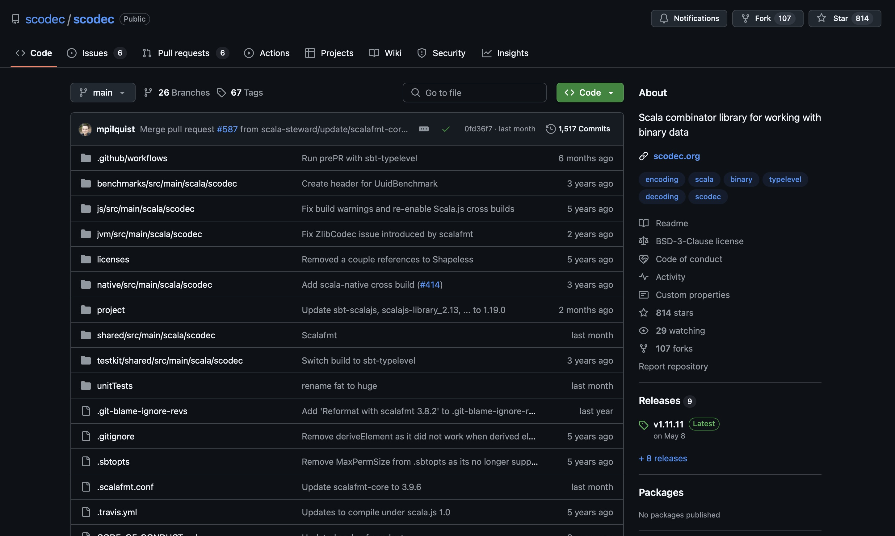
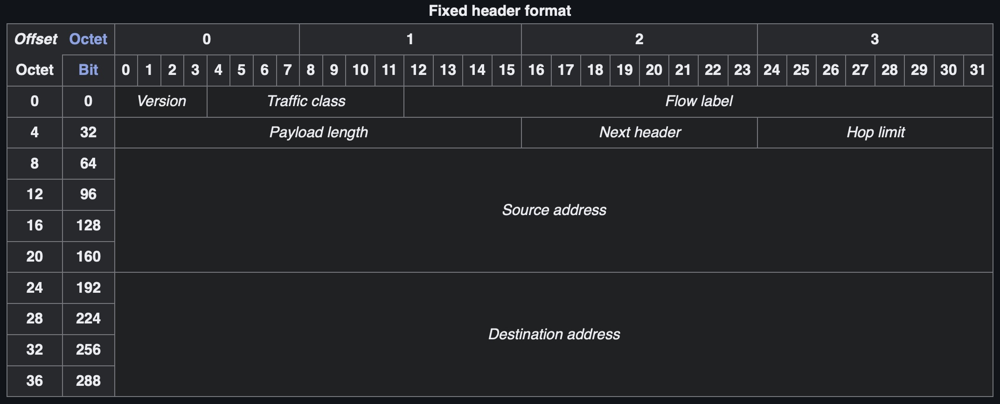
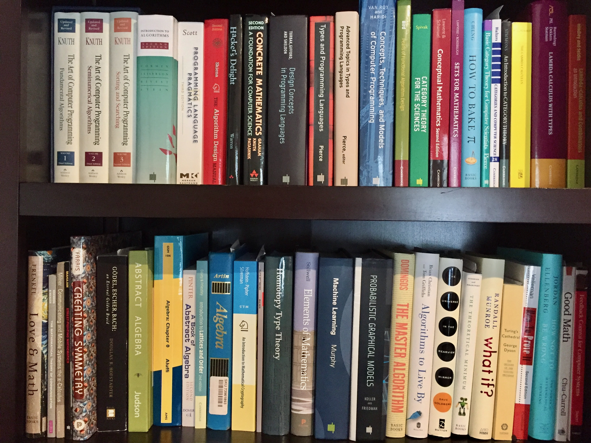

= Compositional Programming
:source-highlighter: highlight.js
:highlightjs-theme: css/solarized-dark.css
:highlightjs-languages: scala
:highlightjsdir: https://cdnjs.cloudflare.com/ajax/libs/highlight.js/11.11.0
:revealjs_theme: moon
:revealjs_hash: true
:customcss: css/presentation.css
:icons: font
:revealjs_width: 1200
:docinfo: private

== Part 1: Complexity

[%notitle]
=== Complexity

"Complexity is the root cause of the vast majority of problems with software today. Unreliability, late delivery, lack of security -- often even poor performance in large-scale systems can all be seen as deriving ultimately from unmanageable complexity."
-- Ben Moseley & Peter Marks, Out of the Tar Pit. 2006

[%notitle]
=== Complexity

"...we have to keep it crisp, disentangled, and simple if we refuse to be crushed by the complexities of our own making..."
-- Edgar Dijkstra, The Tide, Not the Waves. 1997

[%notitle]
=== Complexity

"There are two ways of constructing a software design: One way is to make it so simple that there are _obviously_ no deficiencies, and the other way is to make it so complicated that there are no _obvious_ deficiencies. The first method is far more difficult."
-- C.A.R. Hoare, The Emperor's Old Clothes (Turing Award Lecture). 1980

[%notitle]
=== Complexity

"It demands the same skill, devotion, insight, and even inspiration as the discovery of the simple physical laws which underlie the complex phenomena of nature."
-- C.A.R. Hoare, The Emperor's Old Clothes (Turing Award Lecture). 1980

[%notitle]
=== Complexity

"I have made this longer than usual because I have not had time to make it shorter."
-- Blaise Pascal, Letter 16. 1657

[%notitle]
=== Composition

[%notitle]
=== Composition

[%notitle]
=== Functional Programming

In this talk:

* What is functional programming?
* What is referential transparency?
* What are some useful techniques that promote composition?
* 80/20 rule

== Part 2: Techniques

== Error Handling

[source,scala]
----
def mean(xs: List[Double]): Double =
  if xs.isEmpty then
    throw new ArithmeticException("mean of empty list!")
  else xs.sum / xs.length

def variance(xs: List[Double]): Double =
  val m = mean(xs)
  mean(xs.map(x => math.pow(x - m, 2)))
----

[%step]
[source,scala]
----
> mean(List(1.0, 2.0, 3.0, 4.0, 5.0))
val res0: Double = 3.0

> mean(List(1.0, 2.0, 3.0, 4.0, 5.0))
val res1: Double = 2.0
----

=== Error Handling

[source,scala]
----
def mean(xs: List[Double]): Double =
  if xs.isEmpty then
    throw new ArithmeticException("mean of empty list!")
  else xs.sum / xs.length
----

[source,scala]
----
> mean(List())
java.lang.ArithmeticException: mean of an empty list!
  at rs$line$9$.mean(rs$line$9:2)
  ... 32 elided
----

* `mean` is a partial function -- only defined for part of its domain. 
* We prefer total functions as they compose better

=== Error Handling

[source,scala]
----
enum Option[+A]:
  case Some(get: A)
  case None
----

=== Error Handling

[source,scala]
----
enum Option[+A]:
  case Some(get: A)
  case None

def mean(xs: List[Double]): Option[Double] =                  <1>
  if xs.isEmpty then None
  else Some(xs.sum / xs.length)
----
<1> `mean` is now a total function

=== Error Handling

[source,scala]
----
def variance(xs: List[Double]): Double =
  val m = mean(xs)
  mean(xs.map(x => math.pow(x - m, 2)))
----

[%step]
[source,scala]
----
-- [E134] Type Error: ----------------------------------------------------------
3 |  mean(xs.map(x => math.pow(x - m, 2)))
  |                            ^^^
  |None of the overloaded alternatives of method - in class Double with types
  | (x: Double): Double
  | (x: Float): Double
  | (x: Long): Double
  | (x: Int): Double
  | (x: Char): Double
  | (x: Short): Double
  | (x: Byte): Double
  |match arguments ((m : Option[Double]))
1 error found
----

=== Error Handling

[source,scala]
----
def variance(xs: List[Double]): Option[Double] =
  mean(xs) match
    case Some(m) =>
      mean(xs.map(x => math.pow(x - m, 2)))
    case None => None
----

=== Error Handling

[source,scala]
----
enum Option[+A]:
  case Some(get: A)
  case None

  def map[B](f: A => B): Option[B] =
    this match
      case None => None
      case Some(a) => Some(f(a))
----

=== Error Handling

[source,scala]
----
def variance(xs: List[Double]): Option[Double] =
  mean(xs).map: m =>
    mean(xs.map(x => math.pow(x - m, 2)))
----

[%step]
[source,scala]
----
-- [E007] Type Mismatch Error: -------------------------------------------------
3 |    mean(xs.map(x => math.pow(x - m, 2)))
  |    ^^^^^^^^^^^^^^^^^^^^^^^^^^^^^^^^^^^^^
  |    Found:    Option[Double]
  |    Required: Double
  |
  | longer explanation available when compiling with `-explain`
1 error found
----

=== Error Handling

[source,scala]
----
enum Option[+A]:
  case Some(get: A)
  case None

  def map[B](f: A => B): Option[B] =
    this match
      case None => None
      case Some(a) => Some(f(a))

  def flatMap[B](f: A => Option[B]): Option[B] =
    this match
      case None => None
      case Some(a) => f(a)
----

=== Error Handling

[source,scala]
----
def variance(xs: List[Double]): Option[Double] =
  mean(xs).flatMap: m =>
    mean(xs.map(x => math.pow(x - m, 2)))
----

== Data Modeling

* Data oriented design
* Prefer data over state
* Data is immutable and forever
* Data can be stored, printed, compared
* Make illegal states unrepresentable

=== Data Modeling

[source,scala]
----
trait Host
trait IpAddress
case class Ipv4Address(b0: Byte, ..., b3: Byte) extends IpAddress
case class Ipv6Address(b0: Byte, ..., b15: Byte) extends IpAddress
case class Hostname(...) extends Host
case class IDN(...) extends Host
----

=== Data Modeling

[source,scala]
----
val h1 = IpAddress.fromString("127.0.0.1")
// val h1: Option[IpAddress] = Some(127.0.0.1)

val h2 = IpAddress.fromString("::1")
// val h2: Option[IpAddress] = Some(::1)

val h3 = Host.fromString("localhost")
// val h3: Option[Host] = Some(localhost)

val port = Port.fromInt("8080")
// val port: Option[Port] = Some(8080)
----

=== Data Modeling

[source,scala]
----
val m = MacAddress.fromString("00:11:22:33:44:55")
// val m: Option[MaxAddress] = Some(00:11:22:33:44:55)

val m2 = MacAddress.fromBytes(Array[Byte](0, 17, 34, 51, 68, 85))
// val m2: Option[com.comcast.ip4s.MacAddress] = Some(00:11:22:33:44:55)

val m3 = MacAddress.fromBytes(0, 17, 34, 51, 68, 85)
// val m3: com.comcast.ip4s.MacAddress = 00:11:22:33:44:55
----

[source,scala]
----
object MacAddress:
  def fromBytes(bytes: Array[Byte]): Option[MacAddress] =
    if bytes.length == 6 then Some(new MacAddress(bytes))
    else None

  def fromBytes(b0: Byte, ..., b5: Byte): MacAddress =
    val bytes = new Array[Byte](6)
    bytes(0) = b0
    ...
    bytes(5) = b5
    new MacAddress(bytes)
----

== Persistent data structures

LRU cache in Skunk

== Combinators

=== Combinators

[source,scala]
----
case class DecodeResult[+A](value: A, remainer: BitVector)

trait Decoder[+A]:
  def decode(bv: BitVector): Attempt[DecodeResult]

trait Encoder[-A]:
  def encode(a: A): Attempt[BitVector]

trait Codec[A] extends Encoder[A] & Decoder[A]
----

=== Combinators

[source,scala]
----
case class DecodeResult[+A](value: A, remainer: BitVector):
  def map[B](f: A => B): DecodeResult[B] =
    DecodeResult(f(value), remainder)
----

=== Combinators

[source,scala]
----
case class DecodeResult[+A](value: A, remainer: BitVector):
  def map[B](f: A => B): DecodeResult[B] =
    DecodeResult(f(value), remainder)

trait Decoder[+A]:
  self =>

  def decode(bv: BitVector): Attempt[DecodeResult]

  def map[B](f: A => B): Decoder[B] = new Decoder[B]:
    def decode(bv: BitVector): Attempt[DecodeResult] =
      self.decode(bv).map(_.map(f))
----

=== Combinators

[source,scala]
----
trait Encoder[-A]:
  self =>

  def encode(a: A): Attempt[BitVector]

  def map[B](f: A => B): Encoder[B] = new Encoder[B]:
    def encode(b: B): Attempt[BitVector] =
      ??? // Have a value of b: B and f: A => B
----

=== Combinators

[source,scala]
----
trait Encoder[-A]:
  self =>

  def encode(a: A): Attempt[BitVector]

  def contramap[B](f: B => A): Encoder[B] = new Encoder[B]:
    def encode(b: B): Attempt[BitVector] =
      self.encode(f(b))
----

=== Combinators

[source,scala]
----
trait Codec[A] extends Decoder[A] & Encoder[A]:
  self =>

  def exmap[B](f: A => B, g: B => A): Codec[B] = new Codec[B]:
    def decode(bv: BitVector) = self.decode(bv).map(_.map(f))
    def encode(b: B) = self.encode(g(b))
----

=== Combinators

[source,scala]
----
object Codec:

  extension [A, B <: Tuple](codecA: Codec[A])
    def ::(codecB: Codec[B]): Codec[A *: B] =
      new Codec[A *: B]:
        def encode(ab: A *: B) = encodeBoth(codecA, codecB)(ab.head, ab.tail)
        def decode(bv: BitVector) = decodeBoth(codecA, codecB)(bv).map(_.map(_ *: _))

  extension [A, B](a: Codec[A])
    def ::(b: Codec[B])(using DummyImplicit): Codec[(A, B)] =
      new Codec[(A, B)]:
        def encode(ab: (A, B)) = encodeBoth(a, b)(ab(0), ab(1))
        def decode(bv: BitVector) = decodeBoth(a, b)(bv)
----

=== Combinators

[source,scala]
----
val triple = int32 :: int32 :: int32

val enc = triple.encode(1, 2, 3)
----

=== Combinators

:figure-caption!:

[.columns]
=== Combinators

[.column]
[source,scala]
----
case class Ipv6Header(
  trafficClass: Int,
  flowLabel: Int,
  payloadLength: Int,
  protocol: Int,
  hopLimit: Int,
  sourceIp: Ipv6Address,
  destinationIp: Ipv6Address
)
----

[.column.is-three-fifths]
[source,scala]
----
val ipv6: Codec[Ipv6Address] =
  bytes(16).xmapc(b =>
    Ipv6Address.fromBytes(b.toArray).get
  )(a => ByteVector.view(a.toBytes))

given Codec[Ipv6Header] = {
  ("version"      | constant(bin"0110")) ::
  ("traffic_class"| uint8              ) ::
  ("flow_label"   | uint(20)           ) ::
  ("payload_len"  | uint16             ) ::
  ("next_header"  | uint8              ) ::
  ("hop_limit"    | uint8              ) ::
  ("source_ip"    | ipv6               ) ::
  ("dest_ip"      | ipv6               )
}.as[Ipv6Header]
----

== Typeclasses

[source,scala]
----
trait Semigroup[A]:
  def combine(x: A, y: A): A

trait Monoid[A] extends Semigroup[A]:
  def empty: A
----

=== Typeclasses

[source,scala]
----
given Monoid[Int]:
  def combine(x: Int, y: Int) = x + y
  def empty = 0

given Monoid[String]:
  def combine(x: String, y: String) = x ++ y
  def empty = ""
----

[%step]
[source,scala]
----
given [A] => Monoid[List[A]]:
  def combine(x: List[A], y: List[A]) = x ++ y
  def empty = Nil
----

=== Typeclasses

[source,scala]
----
> summon[Semigroup[Int]].combine(1, 2)
val res0: Int = 3

> summon[Semigroup[String]].combine("Hello", "World")
val res1: String = "HelloWorld"

> summon[Semigroup[List[Int]]].combine(List(1, 2, 3), List(4, 5, 6))
val res2: List[Int] = List(1, 2, 3, 4, 5, 6)
----

=== Typeclasses

[source,scala,highlight=3]
----
trait Semigroup[A]:
  def combine(x: A, y: A): A
  extension (x: A) def |+|(y: A): A = combine(x, y)

trait Monoid[A] extends Semigroup[A]:
  def empty: A
----

[source,scala]
----
> 1 |+| 2
val res0: Int = 3

> "Hello" |+| "World"
val res1: String = "HelloWorld"

> List(1, 2, 3) |+| List(4, 5, 6)
val res2: List[Int] = List(1, 2, 3, 4, 5, 6)
----

[transition=slide-out none]
=== Typeclasses

[source,scala]
----
given [A: Semigroup] => Monoid[Option[A]]:
  def combine(x: Option[A], y: Option[A]) =
    (x, y) match
      case (None,     None) => None
      case (Some(xx), None) => Some(xx)
      case (None,     Some(yy)) => Some(yy)
      case (Some(xx), Some(yy)) => Some(xx |+| yy)

  def empty = None
----

[transition=slide-in none]
=== Typeclasses

[source,scala,highlight=7]
----
given [A: Semigroup] => Monoid[Option[A]]:
  def combine(x: Option[A], y: Option[A]) =
    (x, y) match
      case (None,     None) => None
      case (Some(xx), None) => Some(xx)
      case (None,     Some(yy)) => Some(yy)
      case (Some(xx), Some(yy)) => Some(xx |+| yy)

  def empty = None
----

=== Typeclasses
[source,scala]
----
> Some(1) |+| Some(2)
val res0: Option[Int] = Some(3)

> Some(1) |+| None
val res1: Option[Int] = None
----

=== Typeclasses
[source,scala]
----
given [K, V: Semigroup] => Monoid[Map[K, V]]:
  def combine(x: Map[K, V], y: Map[K, V]) =
    y.foldLeft(x):
      case (acc, (k, v)) =>
        acc.updatedWith(k)(_ |+| Some(v))

  def empty = Map.empty
----

[%step]
[source,scala]
----
val a = Map("hello" -> 1, "world" -> 1)
val b = Map("world" -> 2, "scala" -> 1)
val c = a |+| b
// c = Map(("hello", 1), ("world", 3), ("scala", 1))
----

=== Typeclasses
[source,scala]
----
extension [A](as: IterableOnce[A])
  def combineAll(using m: Monoid[A]): A =
    as.iterator.foldLeft(m.empty)(m.combine)

  def foldMap[B](f: A => B)(using m: Monoid[B]): B =
    as.iterator.foldLeft(m.empty)((acc, a) => acc |+| f(a))
----

=== Typeclasses
[source,scala]
----
def bag[A](as: IterableOnce[A]): Map[A, Int] =
  as.foldMap(a => Map(a -> 1))

scala> val charOccurs = bag("scala".toList)
val charOccurs: Map[Char, Int] = Map(s -> 1, c -> 1, a -> 2, l -> 1)
----

== Part 3: Retrospective

- 7+-2
- Thinking fast and slow
- Inventing on principle
- Constraints liberate
- Courage to create
- Adoption issues
- Time from intro to first monad tutorial
- Survivorship bias
- Weird budgets
- LLMs and relegation to craftmanship

[%notitle]
== Abstract Nonsense

